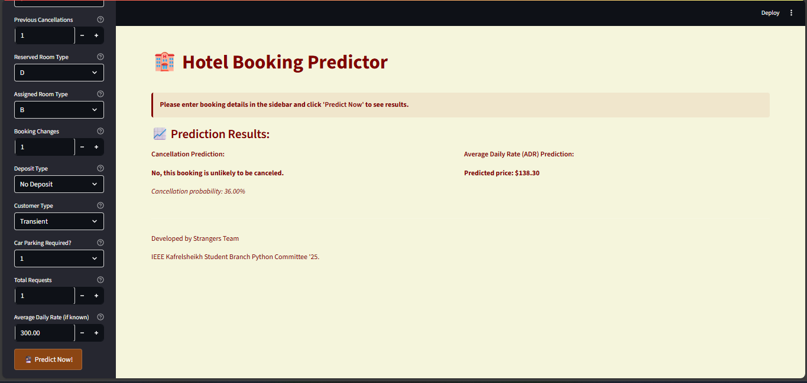

# Hotel Booking Predictor

A smart machine learning web app designed to help hotels predict:
- **Booking Cancellations**
- **Average Daily Rate (ADR)**

[Try the App Live]()

---

## 📸 Screenshots



---

## Tech Stack

- Python
- Streamlit
- scikit-learn
- RandomForest, Linear Regression
- pandas, seaborn, matplotlib
- Joblib for model persistence

---

## How to Run Locally

```bash
git clone https://github.com/your-username/hotel_booking_predictor.git
cd hotel_booking_predictor
pip install -r requirements.txt
streamlit run code/streamlit_app1/app.py
```

## Project Information

This project was built as part of the **IEEE Student Branch '25 Python for Data Analysis Track**  
Supervised by: **Mariam Skoot** & **Waleed Seleem**

## Features
Predicts whether a hotel booking will be cancelled or confirmed

Forecasts ADR (Average Daily Rate) for given conditions

Streamlit web interface for user-friendly experience

Stores prediction outputs and allows downloadable insights (optional)

### Team Members:
- Alaa Salah
- Hagar Mahmoud
- Mohamed Hamed